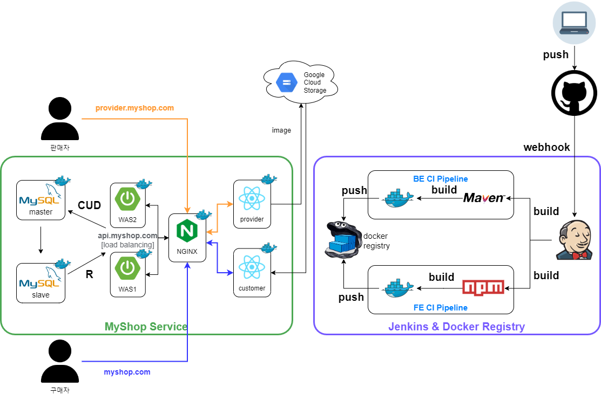

# 🛒 MyShop
- 무신사, 29CM, 지그재그 같은 **온라인 편집샵** 프로젝트  
- 공부했던 JPA와 리액트의 개념을 확실히 잡기 위한 목표
- 사용 기술 : 
- [기술 문서](https://wise-nigella-dd7.notion.site/MyShop-161d91043d4646c8840f43bda762cdeb)

## 🖼️ Architecture

- 젠킨스로 CI, CD 구성
- Nginx로 API 서버 로드밸런싱, 멀티 도메인 사용
- 도커로 각 애플리케이션 이미지화
- DB Replication : write-read 구조의 이중화 구성

[추후 유연성, 확장성, 안정성 확보를 위해 고민하고 레디스 도입 고려]

## 📎 ERD

- 장바구니, 찜 상품, 주문 상품을 제외한 모든 엔티티는 비식별 관계로 매핑됨.

## 📎 UML

- 주문 (Order)
    - 주문 번호는 `날짜+시분초+XXXX`의 형태로 기본키 직접 할당. 1초 간 최대 9999개(1~9999)로 제한됨 (사실상 겹치지 않음)   
    주문 시 `날짜+시분초`로 시작하는 주문번호가 있으면 MAX+1, 없으면 0001.
    - 주문 상태는 주문 요청, 결제, 접수, 취소, 배송 중 및 완료 총 6개의  상태로 구성

- 주문 상품 (OrderItem)
    - 상품별 수량을 다르게 주문 가능
    - 상품별 쿠폰 사용 가능

- 상품 (Item)
    - 상품명, 수량, 내용, 이미지, 가격 등을 입력해 상품 추가

- 상품 이미지 (ItemImage)
    - 상품의 이미지를 저장(순서가 있음)

- 찜 (Wish)
    - 상품 찜, 취소 가능

- 장바구니 (Cart)
    - 상품을 장바구니에 추가, 삭제 가능

- 쿠폰 (Coupon)
    - 판매자가 쿠폰 코드를 생성한 후 구매자들에게 직접 알려주는 형식
    - 쿠폰 발급은 판매자가 쿠폰 코드와 내용, 할인율을 입력해 발급
    - 쿠폰 사용은 구매자가 주문 시 쿠폰 코드를 입력해 상품별로 할인
    - 쿠폰은 코드 하나당 발급 브랜드(판매자)의 한 상품에만 적용 가능(일회성)

- 사용 쿠폰(UsedCoupon)
    - 쿠폰, 구매자, 상품을 묶음.

- 판매자 (Provider)
    - 입점을 하면서 업체명을 등록

- 구매자 (Customer)
    - 회원가입 후 로그인을 해야 장바구니, 찜, 구매 기능 이용 가능