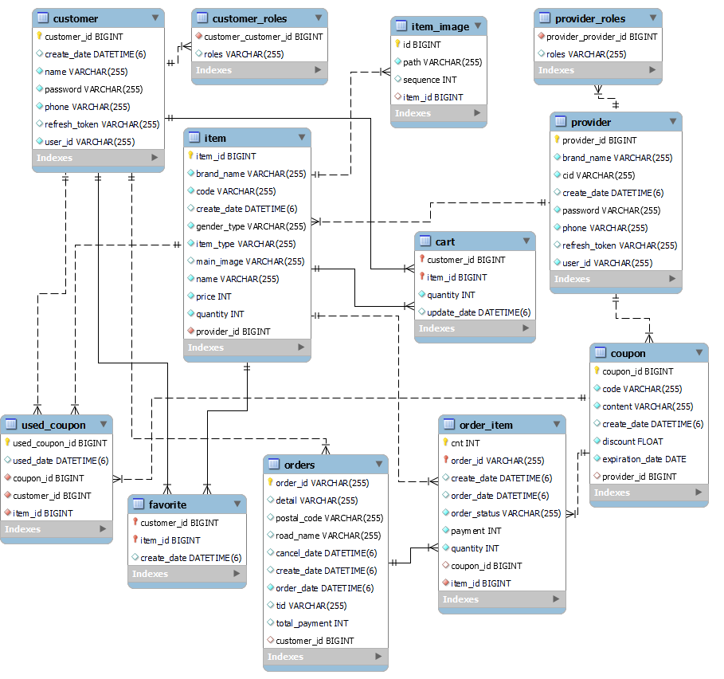

# 🛒 MyShop
- 무신사, 29CM, 지그재그 같은 온라인 편집샵인 '**MyShop**' 프로젝트  
- 공부했던 JPA와 리액트의 개념을 확실히 잡기 위한 목표

## 🖼️ Architecture

- 젠킨스로 CI, CD 구성
- Nginx로 API 서버 로드밸런싱, 멀티 도메인 사용
- 도커로 각 애플리케이션 이미지화
- DB Replication : write-read 구조의 이중화 구성

[추후 유연성, 확장성, 안정성 확보를 위해 고민하고 레디스 도입 고려]

## 📎 ERD

- 모든 도메인 비식별 관계로 매핑
- 추가 인덱스
    - orders : [customer_id]
    - order_item : [order_id]
    - item : [provider_id, customer_id]
    - item_image : [item_id]
    - wish : [customer_id]
    - cart : [customer_id]
    - coupon : [provider_id], [customer_id], [code]

## 📎 UML

- 주문 (Order)
    - 주문 번호는 `날짜+시분초+000X`의 형태. 1초 간 최대 9999개로 제한됨 (사실상 겹치지 않음)   
    주문 시 `날짜+시분초`로 시작하는 주문번호가 있으면 MAX+1, 없으면 0001.
    - 주문 상태는 간단하게 주문 접수 및 취소, 배송 중 및 완료 상태로 간단하게 구성

- 주문 상품 (OrderItem)
    - 상품별 수량을 다르게 주문 가능
    - 상품별 쿠폰 사용 가능

- 상품 (Item)
    - 상품 번호는 `업체명+0000000x`의 형태.
    - 상품명, 수량, 내용, 이미지, 가격 등을 입력해 상품 추가

- 상품 이미지 (ItemImage)
    - 상품의 이미지를 저장(순서가 있음)

- 찜 (Wish)
    - 상품을 찜, 취소 가능

- 장바구니 (Cart)
    - 상품을 장바구니에 추가, 삭제 가능

- 쿠폰 (Coupon)
    - 쿠폰 발급은 판매자가 쿠폰 코드와 내용, 할인율을 입력해 발급
    - 쿠폰 사용은 구매자가 주문 시 쿠폰 코드를 입력해 상품별로 할인
    - 쿠폰은 코드 하나당 한 상품에 적용 가능(일회성)

- 판매자 (Provider)
    - 입점을 하면서 업체명을 등록

- 구매자 (Customer)
    - 회원가입 후 로그인을 해야 마이샵 이용 가능